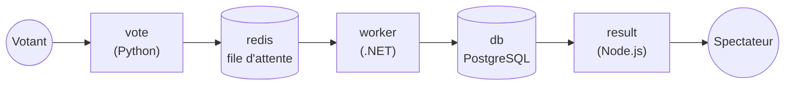

# 02 — Premier Deployment : Kubernetes répare tout seul

> **Scénario à réaliser en binôme.** Vous allez déployer la première brique de l'application fil rouge, puis **la casser volontairement** pour voir Kubernetes la réparer sans aucune intervention humaine. Les blocs marqués `# TODO` sont à compléter vous-mêmes. Le dossier [`solution/`](solution/) contient la réponse, à n'ouvrir qu'en cas de blocage 😉.
>
> 🎯 **Niveau :** débutant. Aucune connaissance en programmation n'est nécessaire.
> On suppose seulement que le [TP00](../00-environnement/README.md) est fait, en mode local ou cloud.
>
> 🧑‍✈️ **En binôme :** le **pilote** tape les commandes, le **copilote** lit la consigne à voix haute et explique ce qu'on observe. **Échangez les rôles à la section 5.**

## ✨ Objectifs

- Comprendre la différence entre **lancer** un conteneur et **décrire ce qu'on veut** (l'état souhaité).
- Écrire et appliquer votre premier fichier YAML Kubernetes : un **Deployment**.
- Supprimer un pod et observer Kubernetes le recréer.
- Distinguer un pod **recréé** d'un conteneur **redémarré**, deux situations qu'on entend souvent en réunion.

## 🗳️ 0 — L'application du jour

Pendant toute la formation, on déploie la **voting app**, une petite application de vote (« Chats ou Chiens ? ») publiée par Docker comme exemple. Elle est volontairement composée de **5 morceaux écrits dans des technologies différentes**, comme beaucoup d'applications d'entreprise :



| Morceau | Rôle |
|---|---|
| `vote` | la page web où l'on vote |
| `redis` | une file d'attente qui stocke les votes en attendant leur traitement |
| `worker` | un programme qui sort les votes de la file et les enregistre |
| `db` | la base de données qui garde les votes |
| `result` | la page web qui affiche les résultats en direct |

Pour `vote`, on utilise une **version adaptée pour la formation** : elle affiche son numéro de version, le nom du pod qui répond, et contient une page qui simule une panne. Vous verrez tout cela en action.

**Aujourd'hui, on ne déploie que `vote`.** Les autres morceaux arriveront au fil des TPs. La page de vote s'affiche très bien toute seule, mais **ne cliquez pas encore sur les boutons** : sans `redis` pour recevoir le vote, vous obtiendrez une erreur `Internal Server Error`. C'est normal.

## 📁 Point de départ

### Vérifier le cluster

Ouvrez VS Code (en mode cloud, il est déjà ouvert dans votre navigateur), puis ouvrez un terminal : menu **Terminal > Nouveau terminal** (*Terminal > New Terminal*). **Dans tout ce TP, on utilise le terminal intégré à VS Code**, en mode local comme en mode cloud.

Vérifiez que votre cluster répond :

```bash
kubectl get nodes
```

Le nœud doit être `Ready`. Si la commande échoue avec `connection refused`, le cluster est arrêté : relancez-le avec `minikube start` (mode local) ou `k3d cluster start tp` (mode cloud), comme vu au TP00.

### Créer le dossier de travail

Vous allez travailler dans un dossier `tp02` qui ne contiendra qu'un seul fichier, `vote.deploy.yml`, écrit à la section 2. Le terminal démarre dans votre **dossier personnel**. Créez-y le dossier :

```bash
mkdir tp02
```

Ouvrez ensuite ce dossier dans VS Code : menu **Fichier > Ouvrir le dossier…** (*File > Open Folder…*), puis choisissez `tp02` dans votre dossier personnel :

| Mode | Chemin du dossier |
|---|---|
| 🅰️ Local, Windows | `C:\Users\<votre-nom>\tp02` |
| 🅰️ Local, macOS | `/Users/<votre-nom>/tp02` |
| 🅱️ Cloud | `/home/student/tp02` |

VS Code se recharge et affiche `TP02` dans l'explorateur, à gauche. Rouvrez un terminal (**Terminal > Nouveau terminal**) : il démarre **directement dans `tp02`**. Ce sera votre **terminal 1**, celui des commandes.

## 🐣 1 — Lancer un pod « à la main »

Commençons par la façon la plus directe de lancer l'application : demander à Kubernetes de démarrer **un pod**.

> 🧠 **Un pod, c'est quoi ?** C'est la plus petite unité que Kubernetes sait faire tourner : une « enveloppe » autour d'un (ou parfois plusieurs) conteneur(s). Pour l'instant, retenez simplement **1 pod = 1 exemplaire de l'application qui tourne**.

Dans le terminal 1, tapez :

```bash
kubectl run vote-solo --image=ghcr.io/bngams/kube-vote:1.0
```

| Élément | Rôle |
|---|---|
| `kubectl run` | « lance un pod » |
| `vote-solo` | le nom qu'on donne au pod |
| `--image=ghcr.io/bngams/kube-vote:1.0` | l'image à utiliser, comme au TP01 : `ghcr.io/bngams` est l'adresse du registre, `kube-vote` le nom de l'image, `1.0` sa version |

Regardez où en est le pod :

```bash
kubectl get pods
```

Le terminal affiche la liste des pods :

```
NAME        READY   STATUS    RESTARTS   AGE
vote-solo   1/1     Running   0          8s
```

Si vous voyez `ContainerCreating`, Kubernetes est encore en train de télécharger l'image : relancez la commande quelques secondes plus tard (astuce : la **flèche ↑** du clavier rappelle la commande précédente).

Maintenant, **supprimez ce pod**, comme le ferait une panne ou une erreur de manipulation, puis listez de nouveau les pods :

```bash
kubectl delete pod vote-solo
kubectl get pods
```

La suppression peut prendre une dizaine de secondes, le temps que l'application s'arrête proprement. Le terminal affiche ensuite :

```
pod "vote-solo" deleted from default namespace
No resources found in default namespace.
```

> 🗂️ **« default namespace » ?** Un *namespace* est un espace de rangement à l'intérieur du cluster. Pour l'instant, tout ce que vous créez va dans celui qui s'appelle `default`. En entreprise, chaque équipe ou projet a généralement le sien : vous le verrez au TP05.

> 🧠 **Ce qui vient de se passer.** Le pod a disparu et **personne ne l'a relancé**. Vous avez donné un **ordre** à Kubernetes (« lance ce pod »), il l'a exécuté, et son travail s'est arrêté là. Pour qu'il surveille l'application et la relance en cas de problème, il faut lui donner un **objectif** plutôt qu'un ordre. C'est le rôle du **Deployment**.

## 📝 2 — Décrire l'état souhaité : le Deployment

Au lieu de dire à Kubernetes **quoi faire**, on va lui décrire **ce qu'on veut obtenir** : « je veux en permanence 1 exemplaire de `vote` en version 1.0 ». On appelle cela l'**état souhaité** (*desired state*). Kubernetes se charge ensuite, en continu, de faire correspondre la réalité à cette description.

Cette description s'écrit dans un fichier texte au format **YAML** : des lignes `clé: valeur`, organisées par **indentation** (des espaces en début de ligne, comme les niveaux d'un sommaire). Voici d'abord la forme générale, **à lire seulement, pas à copier** :

```yaml
apiVersion: apps/v1     # la "version du formulaire" à remplir
kind: Deployment        # le type d'objet qu'on décrit
metadata:               # l'étiquette sur la boîte : son nom
  name: vote
spec:                   # le contenu de la demande : ce qu'on veut obtenir
  replicas: 1           # combien d'exemplaires
  template:             # le modèle de pod à fabriquer
    ...
```

Le tableau ci-dessous détaille les champs du fichier complet. On y note `spec.replicas` pour désigner « le champ `replicas` rangé sous `spec` », et `containers[]` pour signaler que `containers` est une **liste** (chaque élément commence par un tiret `-`).

| Champ | Rôle |
|---|---|
| `kind: Deployment` | on décrit un Deployment, c'est-à-dire un objet qui **maintient** un nombre de pods identiques |
| `metadata.name` | le nom du Deployment ; ses pods porteront ce nom suivi d'un suffixe aléatoire |
| `metadata.labels` | des étiquettes collées sur le Deployment lui-même, pour le retrouver facilement |
| `spec.replicas` | le **nombre d'exemplaires** souhaités, qu'on appelle des **réplicas** |
| `spec.selector.matchLabels` | comment le Deployment **reconnaît ses pods** : tous ceux qui portent l'étiquette `app: vote` |
| `spec.template` | le **modèle** utilisé pour fabriquer chaque pod. Il porte l'étiquette `app: vote`, pour que le Deployment le reconnaisse |
| `containers[].image` | l'image à lancer dans chaque pod, la même qu'à la section 1 |
| `containers[].ports` | le port sur lequel l'application écoute dans le conteneur (80, le port web standard) |

> 🏷️ **Pourquoi `app: vote` apparaît-il plusieurs fois ?** Une étiquette (*label*) est un post-it collé sur un objet. Le `template` colle le post-it `app: vote` sur chaque pod fabriqué, et le `selector` dit au Deployment : « les pods qui portent ce post-it sont à toi ». Ces deux-là doivent donc être **identiques**.

🚧 **À compléter :** dans l'explorateur de VS Code (à gauche), survolez `TP02` et cliquez sur l'icône **Nouveau fichier** (📄+). Tapez `vote.deploy.yml` puis Entrée. Collez-y le contenu ci-dessous, puis remplacez chaque `# TODO` en vous aidant du tableau.

**Règle de remplissage :** remplacez `# TODO` **et tout le texte qui le suit sur la ligne** par la valeur. Par exemple, `name: # TODO : le nom du Deployment : vote` devient `name: vote`.

```yaml
# L'état souhaité : "je veux 1 exemplaire de l'application vote, en version 1.0"
apiVersion: apps/v1
kind: Deployment
metadata:
  name: # TODO : le nom du Deployment : vote
  labels:
    app: vote
spec:
  replicas: # TODO : combien d'exemplaires voulez-vous ? (1 pour commencer)
  selector:
    matchLabels:
      app: vote
  template:
    metadata:
      labels:
        app: # TODO : la même étiquette que dans le selector, juste au-dessus
    spec:
      containers:
        - name: vote
          image: # TODO : l'image de la section 1, sans le "--image=" (seulement ghcr.io/...)
          ports:
            - containerPort: 80
```

N'oubliez pas d'**enregistrer** le fichier (Ctrl+S, ou Cmd+S sur Mac).

> ⚠️ **Piège : l'indentation.** En YAML, les espaces en début de ligne font partie du sens. `replicas` doit être **au même niveau** que `selector` et `template`, c'est-à-dire avec 2 espaces de plus que `spec`. Gardez exactement l'alignement du modèle : si vous collez le bloc tel quel et ne modifiez que la fin des lignes `# TODO`, tout restera bien aligné.
>
> 📖 [Les Deployments, documentation officielle](https://kubernetes.io/fr/docs/concepts/workloads/controllers/deployment/)

## 🚀 3 — Appliquer l'état souhaité

Votre fichier décrit ce que vous voulez. Il faut maintenant le **transmettre** au cluster. C'est le rôle de `kubectl apply`, qu'on utilise pour **tous** les fichiers YAML. Dans le terminal 1, tapez :

```bash
kubectl apply -f vote.deploy.yml
```

Le terminal confirme la création :

```
deployment.apps/vote created
```

Si la commande affiche une erreur, pas d'inquiétude : rien n'a été créé. Repérez votre message dans le tableau, corrigez le fichier, enregistrez, puis relancez la commande.

| Message d'erreur | Cause probable |
|---|---|
| `error parsing vote.deploy.yml` … `did not find expected key` | un problème d'**indentation** à la ligne indiquée |
| `error when retrieving current configuration` … `Name: ""` | le `# TODO` de `name` n'a pas été remplacé |
| `` `selector` does not match template `labels` `` | le `# TODO` de `labels` n'a pas été remplacé, ou la valeur n'est pas `vote` |
| `containers[0].image: Required value` | le `# TODO` de `image` n'a pas été remplacé |
| `the path "vote.deploy.yml" does not exist` | le fichier n'est pas enregistré, ou le terminal n'est pas dans `tp02` |

Vérifiez le résultat, d'abord le Deployment, puis ses pods :

```bash
kubectl get deployments
kubectl get pods
```

Le terminal affiche deux tableaux :

```
NAME   READY   UP-TO-DATE   AVAILABLE   AGE
vote   1/1     1            1           10s

NAME                    READY   STATUS    RESTARTS   AGE
vote-644d47956b-m49cr   1/1     Running   0          10s
```

Voici comment les lire :

| Colonne | Ce qu'elle dit |
|---|---|
| `READY 1/1` (deployment) | 1 pod prêt sur 1 souhaité : **la réalité correspond à l'état souhaité** |
| `NAME vote-644d47956b-m49cr` (pod) | le nom du Deployment (`vote`), suivi de deux suffixes générés automatiquement. **Le vôtre sera différent** |
| `STATUS Running` | le conteneur tourne |
| `RESTARTS 0` | le conteneur n'a jamais redémarré. Gardez cette colonne en tête pour la section 6 |

> ⚠️ Le pod reste en `ErrImagePull`, `ImagePullBackOff` ou `InvalidImageName` ? Kubernetes n'arrive pas à télécharger l'image : vérifiez la ligne `image:`, qui doit être exactement `ghcr.io/bngams/kube-vote:1.0`. Corrigez, enregistrez, puis relancez `kubectl apply -f vote.deploy.yml`.

## 🌐 4 — Voir l'application

L'application tourne **dans** le cluster, qui est isolé du monde extérieur. Pour l'ouvrir dans votre navigateur, on crée un **tunnel** temporaire entre votre machine et le pod avec `kubectl port-forward`. Un **port** est simplement un numéro de « porte » sur lequel une application attend les visiteurs : le tunnel relie une porte de votre côté à la porte de l'application.

Cette commande occupe son terminal tant qu'elle tourne. Ouvrez donc un **terminal 2** à côté du premier : cliquez sur l'icône **Scinder le terminal** (*Split Terminal*, le carré coupé en deux, en haut à droite du panneau Terminal). Dans ce terminal 2, tapez :

```bash
kubectl port-forward deployment/vote 8080:80
```

| Élément | Rôle |
|---|---|
| `deployment/vote` | vers un pod du Deployment `vote` |
| `8080:80` | le port **8080 de votre côté** est relié au port **80 du conteneur** |

Le terminal 2 indique que le tunnel est ouvert, puis ne rend plus la main :

```
Forwarding from 127.0.0.1:8080 -> 80
Forwarding from [::1]:8080 -> 80
```

Laissez-le tourner et ouvrez l'application dans votre navigateur, à l'adresse correspondant à votre mode (en mode cloud, remplacez `N` par votre numéro de session ; le mot de passe peut vous être redemandé) :

| Mode | Adresse |
|---|---|
| 🅰️ Local | `http://localhost:8080` |
| 🅱️ Cloud | `https://lab-kubeN-8080.deltavia.com` |

Vous devez voir la page « Chats ou Chiens ? », avec un badge **v1.0** en haut à droite. En bas de la page, la ligne **« Servi par : vote-644d47956b-m49cr »** affiche le **nom du pod** qui a fabriqué la page (le vôtre sera différent). Notez-le, il va servir dans un instant.

À chaque visite, une ligne `Handling connection for 8080` s'ajoute dans le terminal 2 : c'est normal, le tunnel signale qu'il transporte une requête.

## 💥 5 — On casse : on supprime le pod

🔄 **Échangez les rôles** : le copilote devient pilote.

On va maintenant simuler une panne en supprimant le pod, comme à la section 1. La différence, c'est qu'il y a cette fois un Deployment qui surveille.

Pour **voir** ce qui se passe en direct, ouvrez un **terminal 3** avec l'icône **Scinder le terminal**, et lancez-y une surveillance des pods :

```bash
kubectl get pods --watch
```

L'option `--watch` garde la commande ouverte et affiche une nouvelle ligne à **chaque changement**. Vous avez maintenant trois terminaux côte à côte : 1 pour les commandes, 2 pour le tunnel, 3 pour la surveillance.

> **🧪 Manip — supprimer le pod d'un Deployment**
>
> 1. Cliquez dans le **terminal 1** et supprimez le pod, en remplaçant le nom par **celui de votre pod**. Il est affiché dans le terminal 3 et en bas de la page web : sélectionnez-le à la souris et copiez-le (clic droit > Copier).
>    ```bash
>    kubectl delete pod vote-644d47956b-m49cr
>    ```
>    La commande peut mettre une dizaine de secondes à rendre la main.
> 2. Regardez le **terminal 3**.
>
> *Observé :*
> ```
> NAME                    READY   STATUS              RESTARTS   AGE
> vote-644d47956b-m49cr   1/1     Running             0          4m
> vote-644d47956b-m49cr   1/1     Terminating         0          4m
> vote-644d47956b-hjnlf   0/1     Pending             0          0s
> vote-644d47956b-hjnlf   0/1     ContainerCreating   0          0s
> vote-644d47956b-m49cr   0/1     Completed           0          4m
> vote-644d47956b-hjnlf   1/1     Running             0          1s
> ```
> **Pendant que l'ancien pod s'arrête (`Terminating`), un nouveau pod (`hjnlf`) est déjà créé.** Personne ne l'a demandé.

Les statuts qui ont défilé se lisent ainsi :

| Statut | Signification |
|---|---|
| `Terminating` | le pod est en train de s'arrêter |
| `Pending` | le nouveau pod est accepté, Kubernetes lui cherche une place |
| `ContainerCreating` | le conteneur du nouveau pod démarre |
| `Completed` | l'ancien conteneur s'est arrêté proprement, le pod va disparaître |
| `Running` | le nouveau pod tourne |

Cliquez dans le terminal 3 et arrêtez la surveillance avec **Ctrl+C**.

> 🧠 **Ce qui vient de se passer : la boucle de réconciliation.** En permanence, Kubernetes compare ce que vous avez demandé avec ce qui tourne réellement, et corrige l'écart :
>
> ```mermaid
> flowchart LR
>     A["📄 État souhaité<br/>replicas: 1"] --> C{"Kubernetes compare"}
>     B["👀 Réalité<br/>0 pod"] --> C
>     C -- "il en manque 1" --> D["Crée un pod"]
>     D --> B
> ```
>
> C'est **l'idée centrale de Kubernetes**. On ne lui dit pas « lance ceci », on lui dit « voilà ce que je veux », et il y veille en continu. Une panne, une erreur de manipulation ou un serveur qui redémarre ne sont que des écarts à corriger.

Rechargez maintenant la page dans le navigateur : **elle ne répond plus**. Regardez le **terminal 2**, celui du tunnel : il s'est arrêté avec une erreur.

```
error: lost connection to pod
```

C'est logique : le tunnel était branché sur l'**ancien** pod, qui n'existe plus. Relancez-le dans le terminal 2 (flèche ↑ puis Entrée) :

```bash
kubectl port-forward deployment/vote 8080:80
```

Rechargez la page : la ligne « Servi par » affiche maintenant le **nom du nouveau pod**.

> 💡 **Un tunnel qui casse à chaque panne, ce n'est pas tenable en production.** Au TP04, vous découvrirez le **Service** : une adresse stable qui suit automatiquement les pods, même quand ils sont remplacés.

## 🔁 6 — Autre panne : le conteneur plante

Supprimer un pod n'est pas la seule panne possible. Très souvent, c'est l'**application elle-même** qui plante : un bug, un manque de mémoire… La version de `vote` adaptée pour la formation contient une page spéciale qui simule ce plantage.

Avec le tunnel toujours ouvert dans le terminal 2, ouvrez l'adresse de l'application suivie de **`/crash`** :

| Mode | Adresse |
|---|---|
| 🅰️ Local | `http://localhost:8080/crash` |
| 🅱️ Cloud | `https://lab-kubeN-8080.deltavia.com/crash` |

La page affiche un message avec le nom de votre pod :

```
💥 Le conteneur de vote-644d47956b-hjnlf va s'arrêter... Kubernetes va le redémarrer.
```

Attendez une dizaine de secondes. Pendant le redémarrage, des lignes d'erreur peuvent apparaître dans le terminal 2 : c'est normal. Puis, dans le **terminal 1**, regardez les pods :

```bash
kubectl get pods
```

Le terminal affiche :

```
NAME                    READY   STATUS    RESTARTS     AGE
vote-644d47956b-hjnlf   1/1     Running   1 (6s ago)   2m
```

Le pod a gardé **le même nom**, mais la colonne `RESTARTS` est passée à **1** : Kubernetes a **redémarré le conteneur** à l'intérieur du pod existant.

Rechargez la page d'accueil de l'application : elle s'affiche de nouveau, **sans relancer le tunnel**. Contrairement à la section 5, le tunnel est branché sur le pod, et le pod n'a pas changé.

Les deux pannes de ce TP se comparent ainsi :

| | Pod supprimé (section 5) | Conteneur planté (section 6) |
|---|---|---|
| Qui répare ? | le **Deployment**, qui crée un **nouveau pod** | Kubernetes **redémarre le conteneur** dans le même pod |
| Nom du pod | **change** | **identique** |
| Colonne `RESTARTS` | repart à 0 | augmente de 1 |
| Le tunnel (`port-forward`) | casse, il faut le relancer | continue de fonctionner |

> 🗣️ **En réunion projet.** Quand un développeur dit « *le pod redémarre en boucle* », il parle de la colonne `RESTARTS` qui augmente sans cesse : l'application plante, Kubernetes la relance, elle replante… Le statut affiché devient alors `CrashLoopBackOff`. Kubernetes fait son travail, mais **l'application a un problème** que lui ne peut pas corriger. Vous en provoquerez un au TP06.

## 🧹 7 — Supprimer le Deployment

Dernière expérience : que se passe-t-il si l'on supprime le **Deployment** lui-même ? Arrêtez d'abord le tunnel : cliquez dans le terminal 2 et faites **Ctrl+C**. Puis, dans le **terminal 1** :

```bash
kubectl delete deployment vote
kubectl get pods
```

Le terminal affiche :

```
deployment.apps "vote" deleted from default namespace
NAME                    READY   STATUS        RESTARTS   AGE
vote-644d47956b-hjnlf   1/1     Terminating   0          3m
```

Le pod est en train de s'arrêter. Relancez `kubectl get pods` quelques secondes plus tard :

```
No resources found in default namespace.
```

Cette fois, le pod a disparu **et ne revient pas**. En supprimant le Deployment, vous avez supprimé **l'état souhaité** : Kubernetes n'a plus aucun objectif pour `vote`, il fait donc le ménage.

> 🧠 **Qui possède qui ?** Un Deployment ne gère pas ses pods directement : il passe par un intermédiaire, le **ReplicaSet**, dont le seul travail est de maintenir le bon nombre de pods. C'est lui qui a recréé votre pod à la section 5. C'est aussi de lui que vient le premier suffixe du nom des pods (`644d47956b`). Supprimer le Deployment supprime toute la chaîne :
>
> ```
> Deployment vote                     <- l'objectif, que vous écrivez
> └── ReplicaSet vote-644d47956b      <- le "gardien du nombre", créé automatiquement
>     └── Pod vote-644d47956b-hjnlf   <- l'exemplaire qui tourne
> ```
>
> Vous reverrez le ReplicaSet au TP06 : il joue un rôle clé dans les mises à jour.

Pour terminer, **remettez l'application en place** depuis le terminal 1 : elle servira au TP03.

```bash
kubectl apply -f vote.deploy.yml
```

Vous pouvez fermer les terminaux 2 et 3 (icône 🗑️ du panneau Terminal).

## 🔵 Pour aller plus loin

Ces pistes sont facultatives. Elles s'adressent à ceux qui ont fini en avance ou qui veulent creuser. Dans les commandes, remplacez `<nom-du-pod>`, **chevrons compris**, par le vrai nom d'un de vos pods.

- **Voir toute la chaîne d'un coup :** `kubectl get deployments,replicasets,pods`. Vous y retrouvez les trois niveaux du schéma de la section 7.
- **Le journal de bord d'un pod :** `kubectl describe pod <nom-du-pod>`, puis lisez la section `Events` tout en bas. Elle retrace chaque étape : `Scheduled` (un nœud est choisi), `Pulled` (image récupérée), `Created`, `Started`.
- **Les logs de l'application :** `kubectl logs deployment/vote`. Après un `/crash`, ajoutez `--previous` pour lire les logs du conteneur **d'avant** le plantage.
- **Le propriétaire d'un pod :** `kubectl get pod <nom-du-pod> -o yaml`, puis cherchez `ownerReferences`. Le pod y désigne son ReplicaSet.
- **Mode cloud uniquement :** lancez `k9s`, une interface en mode texte pour naviguer dans le cluster (flèches pour se déplacer, `:q` puis Entrée pour quitter).
- **Un avant-goût du TP03 :** passez `replicas` à `3` dans `vote.deploy.yml`, puis relancez `kubectl apply -f vote.deploy.yml` et `kubectl get pods`. **Remettez ensuite `replicas: 1`** et réappliquez, pour démarrer le TP03 dans le bon état.

> 📖 [kubectl, aide-mémoire officiel](https://kubernetes.io/fr/docs/reference/kubectl/cheatsheet/)

## 🎉 Challenge final

- [ ] Un pod lancé avec `kubectl run` puis supprimé **ne revient pas**.
- [ ] Notre fichier `vote.deploy.yml` est appliqué et `kubectl get deployments` affiche `READY 1/1`.
- [ ] La page de vote s'affiche dans le navigateur, avec le nom du pod en bas.
- [ ] Un pod supprimé est **recréé** avec un nouveau nom.
- [ ] Après `/crash`, le pod garde son nom et `RESTARTS` passe à 1.
- [ ] Le Deployment `vote` est remis en place pour le TP03.

## Récap

- **Un ordre** (`kubectl run`) est exécuté une fois, puis oublié. **Un état souhaité** (un Deployment) est surveillé en permanence.
- Kubernetes compare sans cesse **l'état souhaité** et **la réalité**, et corrige l'écart : c'est la **réconciliation**.
- On décrit l'état souhaité dans un fichier **YAML**, qu'on transmet avec `kubectl apply -f`.
- **Pod supprimé** => le Deployment en crée un nouveau (nouveau nom). **Conteneur planté** => Kubernetes le redémarre dans le même pod (`RESTARTS` + 1).
- Supprimer le Deployment, c'est supprimer l'objectif : les pods disparaissent pour de bon.

➡️ Suite : [03 — Passer à l'échelle](../03-scaling/README.md)
