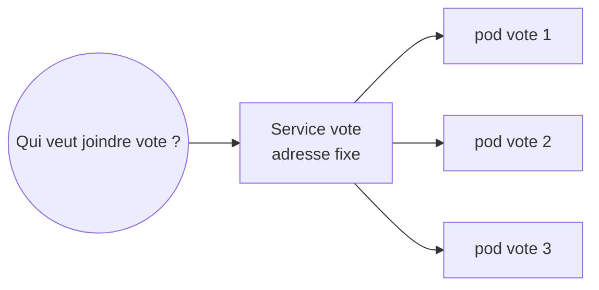
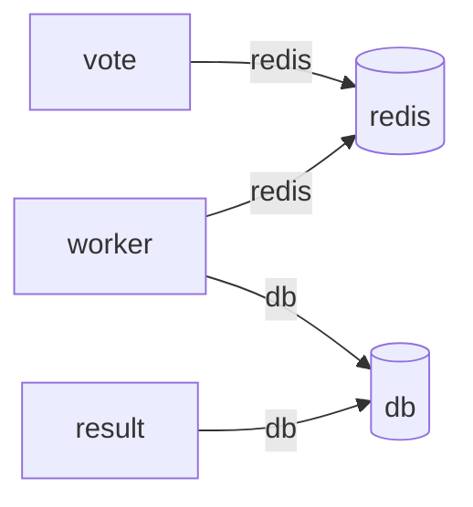
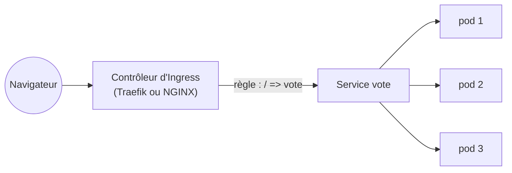

# 04 — Services et Ingress : rendre l'application joignable

> **Scénario à réaliser en binôme.** Vos 3 réplicas de `vote` tournent, mais personne ne sait vraiment comment les joindre : les pods changent d'adresse à chaque remplacement, et le tunnel ne sert qu'un seul pod. Vous allez donner à `vote` une **adresse stable** (un Service), déployer les 4 autres morceaux de l'application, **voter pour de vrai** et suivre les résultats en direct, puis ouvrir une **porte d'entrée** unique (un Ingress) qui répartit les visiteurs. Les blocs marqués `# TODO` sont à compléter vous-mêmes. Le dossier [`solution/`](solution/) contient la réponse, à n'ouvrir qu'en cas de blocage 😉.
>
> 🎯 **Niveau :** débutant. On suppose le [TP03](../03-scaling/README.md) terminé : `vote` tourne avec 3 réplicas.
>
> 🧑‍✈️ **En binôme :** le **pilote** tape les commandes, le **copilote** lit la consigne à voix haute et explique ce qu'on observe. **Échangez les rôles à la section 4.**

## ✨ Objectifs

- Comprendre pourquoi on ne s'adresse jamais directement à un pod.
- Créer un **Service** : une adresse stable et un nom qui répartissent les requêtes entre les pods.
- Déployer l'application complète (5 morceaux) et voir comment ses morceaux se trouvent par leur nom.
- Ouvrir l'application au monde extérieur avec un **Ingress**, et voir la charge se répartir dans le navigateur.

## 📁 Point de départ

On continue dans le dossier `tp02`, ouvert dans VS Code. Ouvrez un terminal (**terminal 1**) et vérifiez que `vote` tourne avec 3 réplicas :

```bash
kubectl get deployments
```

```
NAME   READY   UP-TO-DATE   AVAILABLE   AGE
vote   3/3     3            3           1h
```

Si vous ne voyez pas `3/3`, remettez le fichier du TP03 en place avec `kubectl apply -f vote.deploy.yml`, ou repartez de la [solution du TP03](../03-scaling/solution/vote.deploy.yml).

À la fin de ce TP, le dossier `tp02` contiendra deux nouveaux fichiers, que vous écrirez vous-mêmes :

```
tp02/
├── vote.deploy.yml    <- du TP02 et du TP03
├── vote.svc.yml       <- section 2 : le Service de vote
└── vote.ingress.yml   <- section 6 : la porte d'entrée
```

Les 4 autres morceaux de l'application (`redis`, `db`, `worker`, `result`) vous sont fournis tout prêts dans le dossier [`assets/`](assets/) : vous les appliquerez directement depuis leur adresse en ligne à la section 4.

## 🧭 1 — Le problème : des adresses qui changent

Chaque pod reçoit une **adresse IP** dans le réseau interne du cluster, comme chaque ordinateur sur un réseau. Affichez-les avec l'option `-o wide` vue au TP03 :

```bash
kubectl get pods -o wide
```

Le terminal affiche, parmi d'autres colonnes (vos adresses seront différentes) :

```
NAME                  READY   STATUS    RESTARTS   AGE   IP           NODE
vote-fc57495c-4twgg   1/1     Running   0          1h    10.244.0.4   minikube
vote-fc57495c-5rgkn   1/1     Running   0          1h    10.244.0.3   minikube
vote-fc57495c-8qth4   1/1     Running   0          1h    10.244.0.5   minikube
```

Supprimez le premier pod de **votre** liste, puis regardez de nouveau les adresses :

```bash
kubectl delete pod vote-fc57495c-4twgg
kubectl get pods -o wide
```

```
NAME                  READY   STATUS    RESTARTS   AGE   IP           NODE
vote-fc57495c-5rgkn   1/1     Running   0          1h    10.244.0.3   minikube
vote-fc57495c-8qth4   1/1     Running   0          1h    10.244.0.5   minikube
vote-fc57495c-gfqkp   1/1     Running   0          12s   10.244.0.6   minikube
```

Le pod remplaçant a une **nouvelle adresse** (`10.244.0.6`). Un autre morceau de l'application qui aurait noté l'adresse `10.244.0.4` pour joindre `vote` serait maintenant perdu. Et même avec une adresse fixe, lequel des 3 pods faudrait-il appeler ?

> 🧠 **Les pods sont éphémères.** Ils naissent, meurent et sont remplacés en permanence : c'est le fonctionnement normal de Kubernetes. On ne s'adresse donc **jamais** directement à un pod. Il faut un intermédiaire stable, qui sait à tout moment quels pods sont vivants.

## 🏷️ 2 — Le Service : une adresse stable

Un **Service** est cet intermédiaire. Il porte un **nom** (par exemple `vote`) et une **adresse fixe**, qui ne changent jamais. Il repère les pods à servir grâce à leur **étiquette**, exactement comme le Deployment, et répartit les requêtes entre eux.



Les champs d'un Service se lisent ainsi :

| Champ | Rôle |
|---|---|
| `kind: Service` | on décrit un Service |
| `metadata.name` | son nom, qui devient aussi son **nom d'hôte** dans le cluster : les autres pods pourront le joindre à l'adresse `http://vote` |
| `spec.selector` | les pods à servir : tous ceux qui portent cette étiquette, maintenant et à l'avenir |
| `spec.ports[].port` | le port sur lequel le Service écoute |
| `spec.ports[].targetPort` | le port des pods vers lequel il renvoie les requêtes (le `containerPort` du Deployment) |

🚧 **À compléter :** dans l'explorateur de VS Code, créez un fichier `vote.svc.yml` dans `TP02` (icône **Nouveau fichier**, 📄+), collez-y le contenu suivant, remplacez chaque `# TODO` et tout le texte qui le suit sur la ligne, puis enregistrez.

```yaml
# Une adresse stable, "vote", qui répartit les visiteurs entre tous les pods portant l'étiquette app: vote
apiVersion: v1
kind: Service
metadata:
  name: # TODO : le nom du Service, le même que celui de l'application
  labels:
    app: vote
spec:
  selector:
    app: # TODO : l'étiquette que portent les pods de vote
  ports:
    - port: 80
      targetPort: # TODO : le port de l'application dans le conteneur (le containerPort de vote.deploy.yml)
```

Appliquez-le, puis listez les Services :

```bash
kubectl apply -f vote.svc.yml
kubectl get services
```

```
service/vote created
NAME         TYPE        CLUSTER-IP     EXTERNAL-IP   PORT(S)   AGE
kubernetes   ClusterIP   10.96.0.1      <none>        443/TCP   2h
vote         ClusterIP   10.105.13.80   <none>        80/TCP    0s
```

Votre Service `vote` a reçu une adresse fixe dans la colonne `CLUSTER-IP`. Le type `ClusterIP` signifie qu'elle n'est joignable **qu'à l'intérieur du cluster**. Le Service `kubernetes` existait déjà : c'est celui de Kubernetes lui-même, n'y touchez pas.

Demandez le détail du Service pour voir à qui il transmet les requêtes :

```bash
kubectl describe service vote
```

Parmi les lignes affichées, repérez celles-ci :

```
Selector:                 app=vote
IP:                       10.105.13.80
Endpoints:                10.244.0.3:80,10.244.0.6:80,10.244.0.5:80
```

La ligne `Endpoints` liste les adresses des **3 pods** actuellement servis. Kubernetes la tient à jour tout seul : quand un pod est remplacé, son ancienne adresse disparaît de la liste et la nouvelle y entre.

> ⚠️ **`Endpoints` est vide (`<none>`) ?** Le `selector` ne correspond à aucun pod : vérifiez qu'il indique bien `app: vote`, enregistrez, puis relancez `kubectl apply -f vote.svc.yml`.
>
> 📖 [Les Services, documentation officielle](https://kubernetes.io/fr/docs/concepts/services-networking/service/)

## ⚖️ 3 — Voir la répartition depuis l'intérieur du cluster

Le Service n'est joignable que depuis l'intérieur du cluster. Pour l'essayer, on va lancer un petit pod de test, qui appelle 6 fois l'adresse `http://vote/healthz` puis disparaît. La page `/healthz` de l'application renvoie le nom du pod qui répond.

```bash
kubectl run test --rm -i --restart=Never --image=ghcr.io/bngams/kube-busybox:1.37 -- sh -c "for i in 1 2 3 4 5 6; do wget -qO- http://vote/healthz; echo; done"
```

| Élément | Rôle |
|---|---|
| `kubectl run test` | lance un pod nommé `test`, comme au TP02 |
| `--rm -i --restart=Never` | affiche sa sortie dans votre terminal, puis le supprime dès qu'il a fini |
| `--image=…kube-busybox:1.37` | une toute petite image qui contient des outils de base, dont `wget` pour appeler une adresse web |
| `-- sh -c "for i in …; do wget …; done"` | la commande lancée dans le pod : appeler 6 fois `http://vote/healthz` |

Le terminal affiche 6 réponses, puis la suppression du pod de test :

```
{"hostname":"vote-fc57495c-5rgkn","status":"ok","version":"1.0"}
{"hostname":"vote-fc57495c-5rgkn","status":"ok","version":"1.0"}
{"hostname":"vote-fc57495c-gfqkp","status":"ok","version":"1.0"}
{"hostname":"vote-fc57495c-8qth4","status":"ok","version":"1.0"}
{"hostname":"vote-fc57495c-gfqkp","status":"ok","version":"1.0"}
{"hostname":"vote-fc57495c-8qth4","status":"ok","version":"1.0"}
pod "test" deleted from default namespace
```

Les noms des pods changent d'une réponse à l'autre : le Service **répartit les requêtes** entre les 3 réplicas. La répartition se fait au hasard, donc vous verrez peut-être deux fois de suite le même pod.

> 🧠 **Comment le pod de test a-t-il trouvé `vote` ?** Il a simplement utilisé le **nom** du Service. Le cluster contient un annuaire (un serveur **DNS**) qui traduit automatiquement chaque nom de Service en son adresse fixe. C'est ainsi que les morceaux d'une application se trouvent les uns les autres, sans jamais connaître une seule adresse IP.

## 🧩 4 — Compléter l'application

🔄 **Échangez les rôles** : le copilote devient pilote.

Il est temps de déployer les 4 autres morceaux de l'application. Ils se trouvent par leur nom, grâce aux Services, comme le pod de test vient de le faire :



`vote` dépose chaque vote dans la file d'attente `redis`. `worker` les y prend et les enregistre dans la base `db`. `result` lit la base pour afficher les scores. Chaque flèche est un appel par **nom de Service** : c'est pour cela que les noms `redis` et `db` sont imposés, ils sont écrits dans le code des applications.

Les fichiers sont fournis dans le dossier [`assets/`](assets/). Chacun contient **deux objets** séparés par `---` : un Deployment et son Service (sauf `worker`, que personne n'appelle et qui n'a donc pas besoin de Service). `kubectl apply` sait lire un fichier directement depuis une adresse web : appliquez-les un par un.

```bash
kubectl apply -f https://raw.githubusercontent.com/bngams/kube-overview-labs/main/labs/04-services/assets/redis.yml
kubectl apply -f https://raw.githubusercontent.com/bngams/kube-overview-labs/main/labs/04-services/assets/db.yml
kubectl apply -f https://raw.githubusercontent.com/bngams/kube-overview-labs/main/labs/04-services/assets/worker.yml
kubectl apply -f https://raw.githubusercontent.com/bngams/kube-overview-labs/main/labs/04-services/assets/result.yml
```

Chaque commande confirme la création de ses objets :

```
deployment.apps/redis created
service/redis created
deployment.apps/db created
service/db created
deployment.apps/worker created
deployment.apps/result created
service/result created
```

Vérifiez que tout démarre (en mode local, le premier téléchargement des images peut prendre une minute ; relancez la commande jusqu'à voir tous les pods `Running`) :

```bash
kubectl get pods
```

```
NAME                      READY   STATUS    RESTARTS   AGE
db-55dcdb6f87-9mrtr       1/1     Running   0          40s
redis-8484fcb6dd-pw4k8    1/1     Running   0          45s
result-69d74d779c-65bp4   1/1     Running   0          30s
vote-fc57495c-5rgkn       1/1     Running   0          1h
vote-fc57495c-8qth4       1/1     Running   0          1h
vote-fc57495c-gfqkp       1/1     Running   0          10m
worker-75ccfbcdb5-b99jz   1/1     Running   0          35s
```

> 💡 **`worker` affiche `RESTARTS 1` ou `2` ?** C'est normal s'il a démarré avant que la base soit prête : il a planté, Kubernetes l'a relancé, et il a fini par trouver `db`. Les morceaux d'une application n'ont pas besoin de démarrer dans un ordre précis : la réconciliation finit par tout remettre d'aplomb.

Listez maintenant les Services :

```bash
kubectl get services
```

```
NAME         TYPE        CLUSTER-IP       EXTERNAL-IP   PORT(S)    AGE
db           ClusterIP   10.104.25.144    <none>        5432/TCP   1m
kubernetes   ClusterIP   10.96.0.1        <none>        443/TCP    2h
redis        ClusterIP   10.99.224.249    <none>        6379/TCP   1m
result       ClusterIP   10.108.244.243   <none>        80/TCP     1m
vote         ClusterIP   10.105.13.80     <none>        80/TCP     15m
```

> ⚖️ **Un raccourci assumé.** Le fichier `db.yml` contient le mot de passe de la base **en clair** (`postgres`). C'est une mauvaise pratique, gardée volontairement pour l'instant : au TP05, vous le rangerez dans un **Secret**. Autre simplification : la base ne garde pas ses données si son pod est remplacé. En production, on lui donnerait un **volume persistant**.

## 🗳️ 5 — Voter pour de vrai

Toute la chaîne est en place : on peut enfin voter ! Pour l'instant, les Services ne sont joignables que de l'intérieur du cluster. On utilise donc encore des tunnels, mais cette fois vers les **Services**, et non plus vers un Deployment.

Ouvrez un **terminal 2** (icône **Scinder le terminal**) pour la page de vote :

```bash
kubectl port-forward service/vote 8080:80
```

Puis un **terminal 3** pour la page des résultats, sur le port 8081 :

```bash
kubectl port-forward service/result 8081:80
```

Ouvrez les deux pages, côte à côte si possible (en mode cloud, remplacez `N` par votre numéro de session ; le mot de passe peut vous être redemandé) :

| Page | 🅰️ Local | 🅱️ Cloud |
|---|---|---|
| Vote | `http://localhost:8080` | `https://lab-kubeN-8080.deltavia.com` |
| Résultats | `http://localhost:8081` | `https://lab-kubeN-8081.deltavia.com` |

**Votez !** Cliquez sur « Chats » ou « Chiens » : une coche ✓ confirme votre vote, et la page des résultats se met à jour **en direct**. La page des résultats, qui n'a pas été traduite, affiche « Cats » et « Dogs » : ce sont les mêmes options A et B. Votre binôme peut voter aussi, depuis son propre navigateur ou son téléphone. Chaque navigateur compte pour un votant, qui peut changer d'avis.

> 🧠 **Ce qui vient de se passer.** Votre clic a traversé tout le cluster : `vote` a déposé le vote dans `redis`, `worker` l'a sorti de la file et enregistré dans `db`, et `result` l'a lu dans la base pour l'afficher. Cinq programmes écrits dans quatre technologies différentes (Python, .NET, Node.js, plus Redis et PostgreSQL), qui coopèrent uniquement grâce aux **noms de Services**.

Rechargez maintenant plusieurs fois la page de **vote**, en regardant la ligne « Servi par » : c'est encore **toujours le même pod**. Un `port-forward`, même vers un Service, choisit un seul pod au démarrage. Pour voir la répartition depuis votre navigateur, il faut une vraie porte d'entrée.

## 🚪 6 — L'Ingress : la porte d'entrée du cluster

Un **Ingress** est la porte d'entrée de votre application depuis l'extérieur. Il reçoit les visites web et les **aiguille** vers le bon Service, selon l'adresse demandée. Il ne fonctionne pas tout seul : un programme, le **contrôleur d'Ingress**, applique ses règles. Votre cluster en a un, mais pas le même selon le mode.



| | 🅰️ Local | 🅱️ Cloud |
|---|---|---|
| Contrôleur d'Ingress | NGINX, à activer (étape 1 ci-dessous) | **Traefik**, déjà inclus dans k3s |
| Adresse de la porte d'entrée | `http://localhost:8000`, via un tunnel vers le contrôleur | `https://lab-kubeN-8000.deltavia.com`, ouverte au TP00 avec l'option `--port "8000:80@loadbalancer"` |

### Étape 1 — Mode local uniquement : activer le contrôleur

En mode cloud, passez directement à l'étape 2.

En mode local, minikube fournit le contrôleur NGINX sous forme de module à activer. Commencez par libérer le terminal 2 : cliquez dedans, faites **Ctrl+C** pour arrêter le tunnel de la page de vote. Puis, dans le **terminal 1** :

```bash
minikube addons enable ingress
```

L'activation prend environ une minute. La commande se termine par :

```
The 'ingress' addon is enabled
```

Attendez ensuite que le contrôleur soit prêt. Sinon, l'étape 2 échouera avec un message `failed calling webhook` :

```bash
kubectl wait -n ingress-nginx --for=condition=Ready pod -l app.kubernetes.io/component=controller --timeout=180s
```

| Élément | Rôle |
|---|---|
| `kubectl wait` | attend qu'une condition soit remplie, puis rend la main |
| `-n ingress-nginx` | dans le **namespace** `ingress-nginx`, l'espace de rangement où minikube a installé le contrôleur (vous découvrirez les namespaces au TP05) |
| `--for=condition=Ready` | la condition attendue : « le pod est prêt » |
| `-l app.kubernetes.io/component=controller` | le pod concerné, désigné par son étiquette |

```
pod/ingress-nginx-controller-9cc49f96f-xcw47 condition met
```

### Étape 2 — Décrire la porte d'entrée

Un Ingress se compose de **règles** : « les visites qui arrivent sur tel chemin vont vers tel Service ». Ici, une seule règle suffit : tout ce qui arrive sur `/` (la racine du site, donc toutes les pages) part vers le Service `vote`.

| Champ | Rôle |
|---|---|
| `kind: Ingress` | on décrit une porte d'entrée |
| `rules[].http.paths[].path` | le chemin demandé dans l'adresse. `/` avec `pathType: Prefix` signifie « tout ce qui commence par `/` », donc toutes les pages |
| `backend.service.name` | le Service vers lequel envoyer ces visites |
| `backend.service.port.number` | le port de ce Service (le `port` de `vote.svc.yml`) |

🚧 **À compléter :** créez un fichier `vote.ingress.yml` dans `TP02`, collez-y le contenu suivant, remplacez les `# TODO`, puis enregistrez.

```yaml
# La porte d'entrée du cluster : toutes les requêtes reçues sur "/" sont envoyées au Service vote
apiVersion: networking.k8s.io/v1
kind: Ingress
metadata:
  name: vote
spec:
  rules:
    - http:
        paths:
          - path: /
            pathType: Prefix
            backend:
              service:
                name: # TODO : le Service vers lequel envoyer les visiteurs
                port:
                  number: # TODO : le port de ce Service
```

Appliquez-le dans le terminal 1, puis vérifiez :

```bash
kubectl apply -f vote.ingress.yml
kubectl get ingress
```

```
ingress.networking.k8s.io/vote created
NAME   CLASS     HOSTS   ADDRESS      PORTS   AGE
vote   traefik   *       172.19.0.2   80      10s
```

La colonne `CLASS` indique le contrôleur qui a pris en charge votre Ingress : `traefik` en mode cloud, `nginx` en mode local. Vous n'avez pas eu à le préciser : chaque cluster a un contrôleur **par défaut**. La colonne `ADDRESS` peut rester vide quelques instants en mode local.

### Étape 3 — Entrer par la porte

En **mode cloud**, la porte d'entrée est déjà ouverte : passez à l'ouverture de la page ci-dessous.

En **mode local**, il faut un dernier tunnel, vers le contrôleur NGINX. Lancez-le dans le **terminal 2** :

```bash
kubectl port-forward -n ingress-nginx service/ingress-nginx-controller 8000:80
```

Ouvrez maintenant l'application **par la porte d'entrée**, sur le port 8000 :

| Mode | Adresse |
|---|---|
| 🅰️ Local | `http://localhost:8000` |
| 🅱️ Cloud | `https://lab-kubeN-8000.deltavia.com` |

Rechargez la page plusieurs fois en regardant la ligne « Servi par » : **le nom du pod change** ! Cette fois, chaque visite traverse le contrôleur d'Ingress puis le Service, qui répartit réellement les visiteurs entre les 3 réplicas. Le vote fonctionne aussi par cette porte : la page des résultats (port 8081, toujours ouverte dans le terminal 3) continue de se mettre à jour.

> 💡 **La page des résultats ne passe pas par l'Ingress.** L'application `result` a été écrite pour être servie à la racine d'un site (`/`), et cette place est prise par `vote`. En entreprise, on donne à chaque application son **propre nom de domaine** (`vote.example.com`, `result.example.com`) : un Ingress sait aussi aiguiller selon le nom demandé, grâce au champ `host`. Les sessions de formation n'ont qu'un nom chacune, d'où ce compromis.
>
> 📖 [Ingress, documentation officielle](https://kubernetes.io/fr/docs/concepts/services-networking/ingress/)

## 🗺️ 7 — Les façons d'exposer une application

Vous avez rencontré deux des façons d'exposer une application. Voici le paysage complet, pour vous y retrouver quand une équipe en parle :

| Objet | Joignable depuis | Usage typique |
|---|---|---|
| Service `ClusterIP` (par défaut) | l'intérieur du cluster seulement | faire communiquer les morceaux d'une application (`redis`, `db`) |
| Service `NodePort` | l'extérieur, sur un port (30000 à 32767) de chaque nœud | tests, petits environnements |
| Service `LoadBalancer` | l'extérieur, via un répartiteur de charge fourni par le cloud (une adresse IP publique) | exposer un service non web, ou un contrôleur d'Ingress |
| **Ingress** | l'extérieur, en HTTP/HTTPS, avec des règles par nom et par chemin | le cas le plus courant pour les sites et les API web |

> 🗣️ **En réunion projet.** « *Il faut ajouter une règle d'Ingress* » signifie qu'on veut rendre une application (ou une nouvelle adresse) accessible depuis l'extérieur. C'est aussi au niveau de l'Ingress qu'on installe généralement les **certificats HTTPS** et qu'on branche les noms de domaine. Vous entendrez peut-être parler de **Gateway API** : c'est le successeur de l'Ingress, plus riche, qui s'impose progressivement dans les nouveaux projets.

## 🔵 Pour aller plus loin

Ces pistes sont facultatives.

- **Le nom complet d'un Service :** relancez le pod de test de la section 3 en remplaçant `http://vote/healthz` par `http://vote.default.svc.cluster.local/healthz`. C'est le nom complet : `vote` (le Service), `default` (son namespace), puis le suffixe du cluster. Le nom court `vote` ne fonctionne que depuis le même namespace.
- **Le Service suit les pods en direct :** dans un terminal, lancez `kubectl get endpointslices -l kubernetes.io/service-name=vote --watch`, puis supprimez un pod `vote` depuis un autre terminal. La liste des adresses change sous vos yeux.
- **Les logs du worker :** `kubectl logs deployment/worker` affiche une ligne `Processing vote for 'a' by '…'` pour chaque vote traité.
- **Dans la base :** `kubectl exec deployment/db -- psql -U postgres -c "select vote, count(*) from votes group by vote"` interroge directement PostgreSQL. `kubectl exec` lance une commande **dans** un conteneur, comme `docker exec` au TP01.
- **Mode cloud uniquement :** dans `k9s`, tapez `:svc` puis Entrée pour lister les Services, et `:ing` pour les Ingress.

## 🎉 Challenge final

- [ ] Nous avons vu un pod remplaçant recevoir une nouvelle adresse IP.
- [ ] Notre Service `vote` liste 3 adresses dans `Endpoints`.
- [ ] Le pod de test a obtenu des réponses de plusieurs pods différents.
- [ ] Les 5 morceaux de l'application sont `Running`.
- [ ] Nous avons voté, et la page des résultats s'est mise à jour en direct.
- [ ] Par l'Ingress (port 8000), le nom du pod change d'un rechargement à l'autre.

Pour terminer, laissez l'application en place : elle servira au TP05. Vous pouvez arrêter les tunnels (Ctrl+C dans les terminaux 2 et 3) et fermer ces terminaux.

## Récap

- Les pods sont **éphémères** : leurs adresses changent. On ne s'adresse jamais directement à un pod.
- Un **Service** donne un **nom** et une **adresse stables** à un groupe de pods, repérés par leur étiquette, et répartit les requêtes entre eux.
- Les morceaux d'une application se trouvent par **nom de Service**, grâce au DNS du cluster.
- Un **Ingress** est la porte d'entrée depuis l'extérieur : il aiguille les visites vers les Services, grâce à un **contrôleur d'Ingress** (Traefik, NGINX…).
- `ClusterIP` pour l'intérieur, Ingress pour le web extérieur : c'est la combinaison la plus courante.

➡️ Suite : [05 — Configuration, secrets et namespaces](../05-configuration/README.md)
