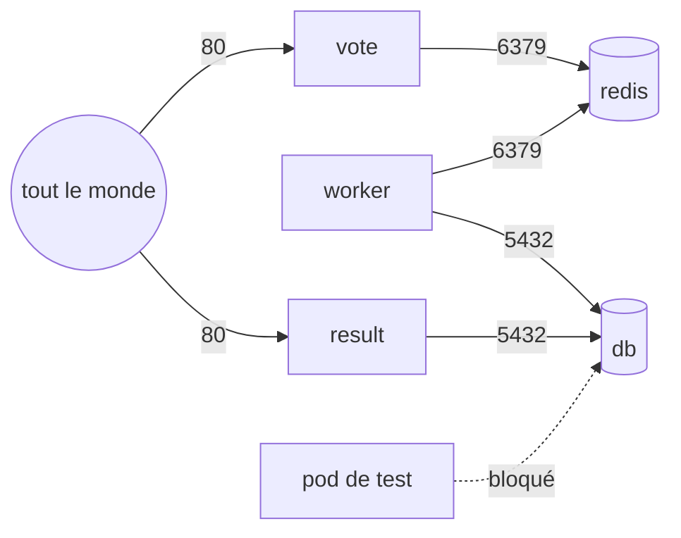

# 05 — Isoler et encadrer : namespaces, quotas, règles réseau

> **Scénario à réaliser en binôme.** Au TP04, les Services ont permis aux morceaux de l'application de se trouver. Mais ils ne protègent rien : n'importe quel pod peut joindre la base de données, et rien ne limite ce qu'une équipe consomme. Vous allez **ranger** l'application dans son propre namespace, **plafonner** ses ressources avec un quota, puis **fermer le réseau** pour n'ouvrir que les flux utiles. Le dossier [`solution/`](solution/) récapitule les commandes, à n'ouvrir qu'en cas de blocage 😉.
>
> 🎯 **Niveau :** débutant. On suppose le [TP04](../04-services/README.md) terminé : les 5 morceaux de l'application tournent dans `default`.
>
> 🧑‍✈️ **En binôme :** le **pilote** tape les commandes, le **copilote** lit la consigne à voix haute et explique ce qu'on observe. **Échangez les rôles à la section 3.**

## ✨ Objectifs

- Ranger une application dans son **namespace**, et comprendre pourquoi on ne travaille pas dans `default`.
- Plafonner les ressources d'un namespace avec un **quota**.
- Comprendre les **règles réseau** (*NetworkPolicies*) : tout fermer, puis n'ouvrir que les flux utiles.
- Connaître les autres règles qu'on peut poser sur un namespace, et les outils qui les vérifient.

## 📁 Point de départ

On continue dans le dossier `tp02`, ouvert dans VS Code, avec un **terminal 1** pour les commandes.

### 🅰️ Mode local uniquement : un cluster capable d'appliquer des règles réseau

En mode cloud, passez directement à la section 1.

Les règles réseau ne fonctionnent que si le réseau du cluster sait les appliquer. C'est le rôle d'un composant réseau comme **Calico**, que minikube n'installe que si on le lui demande (option `--cni=calico`). Vérifiez si le vôtre l'a :

```bash
kubectl get pods -n kube-system -l k8s-app=calico-node
```

- La commande affiche un pod `calico-node-…` `Running` : votre cluster est prêt, passez à la section 1.
- Elle répond `No resources found` : il faut recréer le cluster, comme ci-dessous.
- Elle échoue avec `connection refused` : minikube est arrêté. Lancez `minikube start`, puis refaites la vérification.

Pour recréer le cluster avec Calico (5 à 10 minutes) :

```bash
minikube delete
minikube start --driver=docker --cni=calico --memory=max
minikube addons enable ingress
kubectl wait -n ingress-nginx --for=condition=Ready pod -l app.kubernetes.io/component=controller --timeout=300s
```

| Commande | Rôle |
|---|---|
| `minikube delete` | supprime le cluster actuel. ⚠️ Un simple `minikube stop` ne suffit pas : un cluster existant garde son ancien réseau, et l'option `--cni` serait ignorée **sans message d'erreur** |
| `minikube start --cni=calico` | recrée le cluster avec le réseau Calico |
| `minikube addons enable ingress` | réactive la porte d'entrée du TP04 |
| `kubectl wait …` | attend que la porte d'entrée soit prête, comme au TP04 |

La dernière commande se termine par `condition met`. Votre application a disparu avec l'ancien cluster, et les tunnels des TP précédents ne fonctionnent plus : c'est normal, tout est redéployé à la section 1. Vos fichiers dans `tp02`, eux, sont intacts.

## 🗂️ 1 — Ranger l'application dans son namespace

Depuis le TP02, vos commandes répondent souvent `… from default namespace`. **`default` est le namespace par défaut** : tout ce qu'on crée sans préciser de namespace y atterrit. En pratique, c'est un fourre-tout. On range chaque application, chaque équipe ou chaque environnement dans **son propre namespace**, pour séparer les noms, les réglages, les droits et les ressources.

Listez les namespaces de votre cluster :

```bash
kubectl get namespaces
```

```
NAME              STATUS   AGE
default           Active   1d
kube-node-lease   Active   1d
kube-public       Active   1d
kube-system       Active   1d
```

Vos âges seront différents. En mode local, vous verrez aussi `ingress-nginx`, le namespace du contrôleur d'Ingress. `kube-system` contient les composants de Kubernetes lui-même : n'y touchez jamais.

### Étape 1 — Faire le ménage dans `default`

Si vous venez de recréer votre cluster local (`minikube delete`), il est vide : passez à l'étape 2. Dans tous les autres cas (mode cloud, ou minikube qui avait déjà Calico), votre application tourne encore dans `default` : supprimez-la. Vos fichiers, eux, restent intacts : `kubectl delete -f` supprime seulement les objets dans le cluster.

```bash
kubectl delete -f vote.ingress.yml -f vote.svc.yml -f vote.deploy.yml
kubectl delete -f https://raw.githubusercontent.com/bngams/kube-overview-labs/main/labs/04-services/assets/redis.yml
kubectl delete -f https://raw.githubusercontent.com/bngams/kube-overview-labs/main/labs/04-services/assets/db.yml
kubectl delete -f https://raw.githubusercontent.com/bngams/kube-overview-labs/main/labs/04-services/assets/worker.yml
kubectl delete -f https://raw.githubusercontent.com/bngams/kube-overview-labs/main/labs/04-services/assets/result.yml
```

### Étape 2 — Créer le namespace et en faire le namespace par défaut

Créez le namespace de l'application, `vote-app`, puis demandez à `kubectl` de l'utiliser **par défaut**. Ainsi, toutes vos commandes viseront `vote-app` sans avoir à ajouter `-n vote-app` à chaque fois :

```bash
kubectl create namespace vote-app
kubectl config set-context --current --namespace=vote-app
```

```
namespace/vote-app created
Context "minikube" modified.      <- en mode local
Context "k3d-tp" modified.        <- en mode cloud
```

| Commande | Rôle |
|---|---|
| `kubectl create namespace vote-app` | crée le namespace |
| `kubectl config set-context --current --namespace=vote-app` | règle le namespace par défaut de votre `kubectl` |

### Étape 3 — Redéployer l'application

Relancez exactement les mêmes commandes qu'au TP04 : grâce à l'étape 2, tout part dans `vote-app`.

```bash
kubectl apply -f https://raw.githubusercontent.com/bngams/kube-overview-labs/main/labs/04-services/assets/redis.yml
kubectl apply -f https://raw.githubusercontent.com/bngams/kube-overview-labs/main/labs/04-services/assets/db.yml
kubectl apply -f https://raw.githubusercontent.com/bngams/kube-overview-labs/main/labs/04-services/assets/worker.yml
kubectl apply -f https://raw.githubusercontent.com/bngams/kube-overview-labs/main/labs/04-services/assets/result.yml
kubectl apply -f vote.deploy.yml -f vote.svc.yml -f vote.ingress.yml
```

Vérifiez que tout tourne. Relancez la commande jusqu'à ce que les 7 pods soient `Running` (en mode local, les images se téléchargent de nouveau) :

```bash
kubectl get pods
```

Rouvrez les deux pages, comme au TP04 :

| Page | 🅰️ Local | 🅱️ Cloud |
|---|---|---|
| Vote | dans un **terminal 2** : `kubectl port-forward -n ingress-nginx service/ingress-nginx-controller 8000:80`, puis `http://localhost:8000` | `https://lab-kubeN-8000.deltavia.com` |
| Résultats | dans un **terminal 3** : `kubectl port-forward service/result 8081:80`, puis `http://localhost:8081` | même commande dans un **terminal 3**, puis `https://lab-kubeN-8081.deltavia.com` |

> 🧠 **Ce qui vient de se passer.** L'application est identique, mais elle vit maintenant dans son propre espace. Un `kubectl get pods` sans option ne montre plus que ses pods, et un autre projet pourrait avoir ses propres `vote` ou `redis` dans un autre namespace, sans conflit.

## 🔓 2 — Le constat : tout le monde peut parler à tout le monde

Les Services rendent les morceaux de l'application joignables… par **tout le monde**. Lancez un pod de test (le même qu'au TP04), et demandez-lui s'il peut ouvrir une connexion vers la base de données et vers redis :

```bash
kubectl run test --rm -i --restart=Never --image=ghcr.io/bngams/kube-busybox:1.37 -- sh -c "nc -z -w 3 db 5432 && echo db: ouvert || echo db: bloqué; nc -z -w 3 redis 6379 && echo redis: ouvert || echo redis: bloqué"
```

`nc -z` (*netcat*) teste seulement si une connexion est possible, sans rien envoyer. Le terminal affiche :

```
db: ouvert
redis: ouvert
pod "test" deleted from vote-app namespace
```

Si `db` apparaît `bloqué`, la base termine son démarrage : attendez 30 secondes et relancez.

> ⚠️ **Pourquoi c'est un problème ?** Ce pod de test n'a rien à voir avec l'application, et il joint pourtant la base de données. Si un jour un pod est compromis (une faille dans une application, une image piégée), il pourra atteindre **tout** le reste. Par défaut, le réseau de Kubernetes est entièrement ouvert.

On va corriger cela à la section 4. Mais d'abord, un autre manque.

## 📏 3 — Encadrer les ressources : le quota

🔄 **Échangez les rôles** : le copilote devient pilote.

Rien n'empêche aujourd'hui une équipe de lancer des centaines de pods dans son namespace, au détriment des autres. Un **quota** (*ResourceQuota*) fixe un plafond pour tout un namespace. Créez-en un qui limite `vote-app` à **12 pods** :

```bash
kubectl create quota pods-max --hard=pods=12
```

Votre application compte 7 pods. Demandez 10 exemplaires de `vote`, ce qui porterait le total à 14 :

```bash
kubectl scale deployment vote --replicas=10
kubectl get deployment vote
```

Quelques secondes plus tard, le terminal affiche :

```
NAME   READY   UP-TO-DATE   AVAILABLE   AGE
vote   8/10    8            8           2h
```

Regardez la colonne `UP-TO-DATE` : 8 exemplaires seulement ont été créés (en mode local, `READY` peut être un peu plus bas si votre poste manque de processeur). Les 8 `vote` et les 4 autres pods font 12, le plafond. Le quota tient ses comptes :

```bash
kubectl describe quota pods-max
```

```
Name:       pods-max
Namespace:  vote-app
Resource    Used  Hard
--------    ----  ----
pods        12    12
```

Et Kubernetes explique son refus dans les événements du namespace (une longue ligne, à lire jusqu'au bout) :

```bash
kubectl get events --field-selector reason=FailedCreate
```

```
… Error creating: pods "vote-…" is forbidden: exceeded quota: pods-max, requested: pods=1, used: pods=12, limited: pods=12
```

Remettez l'application dans son état normal (le fichier fait foi, comme au TP03), puis supprimez le quota pour la suite de la formation :

```bash
kubectl apply -f vote.deploy.yml
kubectl delete quota pods-max
```

Un quota peut plafonner bien d'autres choses que le nombre de pods :

| Règle | Ce qu'elle encadre | Exemple |
|---|---|---|
| **ResourceQuota** | le **total** d'un namespace | 12 pods, 4 processeurs réservés, 8 Gi de mémoire, 2 volumes… |
| **LimitRange** (plage de limites) | chaque pod **individuellement** | réservation par défaut si le fichier n'en donne pas, maximum par conteneur |

> 🗣️ **En réunion projet.** Les quotas servent à **partager un cluster** entre équipes sans qu'une seule ne monopolise tout, et à **répartir les coûts** : la somme des quotas dit qui consomme quoi.

## 🔒 4 — Restreindre le réseau : les NetworkPolicies

Une **NetworkPolicy** est une règle réseau qui dit, pour un groupe de pods : « qui a le droit de me contacter, et sur quel port ». La bonne pratique tient en une phrase : **tout fermer, puis n'ouvrir que le nécessaire**.

### Étape 1 — S'entraîner dans l'éditeur visuel

Avant d'appliquer quoi que ce soit, prenez une dizaine de minutes pour manipuler l'éditeur visuel [editor.networkpolicy.io](https://editor.networkpolicy.io/) (aucun compte nécessaire, interface en anglais).

| Zone de l'éditeur | Rôle |
|---|---|
| la boîte du **centre** | les pods concernés par la règle (le *podSelector*) |
| la boîte de **gauche** | les règles **entrantes** (*ingress*) : qui peut contacter ces pods |
| la boîte de **droite** | les règles **sortantes** (*egress*) : qui ces pods peuvent contacter |
| l'icône **[+]** sur chaque boîte | ajouter une règle |
| en bas à gauche | le **YAML** correspondant, mis à jour en direct |
| en bas à droite | un **tutoriel** pas à pas |

🚧 **À vous de jouer :** suivez le début du tutoriel intégré, puis essayez de décrire cette règle : « les pods `app: db` n'acceptent que les connexions venant des pods `app: worker` et `app: result`, sur le port 5432 ». Regardez le YAML se construire en bas à gauche.

### Étape 2 — Appliquer les règles de l'application

Les règles de l'application de vote vous sont fournies dans un seul fichier, [`assets/vote-app.netpol.yml`](assets/vote-app.netpol.yml), qui contient 4 NetworkPolicies :



| NetworkPolicy | Règle |
|---|---|
| `tout-fermer` | par défaut, aucun pod du namespace n'accepte de connexion entrante |
| `pages-web-ouvertes` | `vote` et `result` acceptent tout le monde, sur le port 80 (ce sont les pages web) |
| `redis-pour-vote-et-worker` | `redis` n'accepte que `vote` et `worker`, sur le port 6379 |
| `db-pour-worker-et-result` | `db` n'accepte que `worker` et `result`, sur le port 5432 |

La dernière règle est celle que vous avez dessinée dans l'éditeur. Appliquez le fichier :

```bash
kubectl apply -f https://raw.githubusercontent.com/bngams/kube-overview-labs/main/labs/05-isolation/assets/vote-app.netpol.yml
kubectl get networkpolicies
```

```
NAME                        POD-SELECTOR           AGE
db-pour-worker-et-result    app=db                 1s
pages-web-ouvertes          app in (result,vote)   1s
redis-pour-vote-et-worker   app=redis              1s
tout-fermer                 <none>                 1s
```

Relancez le pod de test de la section 2 (recopiez la commande) :

```
db: bloqué
redis: bloqué
pod "test" deleted from vote-app namespace
```

> ⚠️ **Encore `ouvert` ?** Votre cluster n'applique pas les règles réseau. En mode local, revoyez l'encadré du début : minikube doit avoir Calico.

Le pod de test ne joint plus ni la base ni redis : il ne porte aucune des étiquettes autorisées. Vérifiez maintenant que l'application, elle, fonctionne toujours : rechargez la page de vote et **votez**. La coche apparaît, et le compteur de la page des résultats bouge : `vote` a toujours le droit de parler à `redis`, et `worker` à `db`.

> 🧠 **Ce qui vient de se passer.** Les règles s'appuient sur les **étiquettes** des pods, comme les Services et les Deployments : « les pods `app: worker` peuvent parler aux pods `app: db` ». Elles suivent donc les pods automatiquement, même quand ils sont remplacés et changent d'adresse.
>
> ⚖️ Ces règles ne portent que sur le trafic **entrant**. On peut aussi limiter le trafic **sortant** (*egress*), par exemple pour qu'aucun pod ne puisse joindre Internet, mais il faut alors penser à autoriser l'annuaire du cluster (le DNS du TP04), sans quoi plus rien ne se trouve par son nom.
>
> 📖 [NetworkPolicies, documentation officielle](https://kubernetes.io/docs/concepts/services-networking/network-policies/)

## 🛡️ 5 — Les autres règles d'un namespace

Le namespace est l'endroit où l'on pose les règles d'une équipe ou d'une application. Vous en avez vu deux ; voici le paysage complet, à connaître sans entrer dans les détails :

| Règle | Question à laquelle elle répond |
|---|---|
| **ResourceQuota**, **LimitRange** (section 3) | combien de ressources ce namespace peut-il consommer ? |
| **NetworkPolicy** (section 4) | qui peut parler à qui ? |
| **RBAC** (droits d'accès) | qui a le droit de faire quoi dans ce namespace ? (« l'équipe A peut déployer dans `vote-app`, mais pas lire ses Secrets ») |
| **Pod Security** | quel niveau de sécurité les pods doivent-ils respecter ? (interdire les conteneurs qui tournent en administrateur, par exemple) |

Ces règles sont nombreuses et faciles à oublier. Des outils vérifient automatiquement que tout ce qui entre dans le cluster les respecte : ce sont des **moteurs de politiques**.

| Outil | Exemples de règles |
|---|---|
| **Kyverno** | « toute image doit venir de notre registre », « tout pod doit avoir des réservations », « interdire la version `:latest` », « tout namespace reçoit automatiquement un quota et une règle `tout-fermer` » |
| **OPA Gatekeeper** | les mêmes besoins, avec un autre langage de règles |

> 🗣️ **En réunion projet.** « *Le déploiement a été refusé par une policy* » : un moteur comme Kyverno a bloqué un fichier qui ne respectait pas une règle de l'entreprise. C'est voulu : les règles de sécurité et de bonnes pratiques sont vérifiées **automatiquement**, avant même d'arriver en production.

## 🔵 Pour aller plus loin

- **Tous les namespaces d'un coup :** `kubectl get pods -A` (pour *all namespaces*) liste les pods de tout le cluster, avec une colonne `NAMESPACE`.
- **Changer de namespace par défaut :** `kubectl config set-context --current --namespace=default` vous ramène dans `default`. Pensez à revenir ensuite dans `vote-app`.
- **Tester une règle réseau :** supprimez la règle `pages-web-ouvertes` (`kubectl delete networkpolicy pages-web-ouvertes`), patientez quelques secondes, puis rechargez la page de vote : une erreur (`502` ou `504`, parfois au bout d'une minute) remplace la page, puisque même le contrôleur d'Ingress n'a plus le droit d'entrer. Réappliquez ensuite le fichier.
- **Visualiser vos règles :** collez le contenu de [`assets/vote-app.netpol.yml`](assets/vote-app.netpol.yml), une règle à la fois, dans la zone YAML de l'éditeur visuel.

## 🎉 Challenge final

- [ ] L'application tourne dans le namespace `vote-app`, qui est notre namespace par défaut.
- [ ] Nous avons vu un quota refuser des pods (`exceeded quota`), puis remis l'application à 3 réplicas.
- [ ] Nous avons décrit une règle réseau dans l'éditeur visuel.
- [ ] Après application des NetworkPolicies, le pod de test ne joint plus `db` ni `redis`, mais le vote fonctionne toujours.
- [ ] Nous savons citer les règles qu'on peut poser sur un namespace, et ce qu'apporte un outil comme Kyverno.

## Récap

- Un **namespace** range une application, une équipe ou un environnement. On évite de tout mettre dans `default`.
- Un **quota** plafonne les ressources d'un namespace : utile pour partager un cluster et répartir les coûts.
- Par défaut, **le réseau est ouvert** : les Services rendent tout joignable par tout le monde.
- Les **NetworkPolicies** ferment le réseau puis ouvrent les seuls flux utiles, en s'appuyant sur les étiquettes des pods.
- Droits d'accès, sécurité des pods, moteurs de politiques comme **Kyverno** : le namespace est le lieu où l'on encadre une équipe.

➡️ Suite : [06 — Configuration et secrets](../06-configuration/README.md)
